# Buillding a MERN application

Step by Step example creating a MERN application.

_by Armando Pensado_ 

## Description

Putting together a MERN application is a complicated task, and it requires many manual steps and considerations. This article takes the reader through the steps required using an example. I hope new MERN developers will find beneficial.

* MERN reference: https://www.mongodb.com/blog/post/the-modern-application-stack-part-1-introducing-the-mean-stack

## Key ideas about MERN applicaitons

* MERN is a Single-page applications using MVC patern.

* MERN Uses React, NodeJS, npm on top of conventional languages.

* The application has a single HTML page (index.html).

* The content in the page is dynamically generated based on the routes.

* Interaction is based on AJAX calls to itself (access to DB or other resources).

* For the most part JavaScript is used to generate the page contents (JSX).

* MERN is a solution that in its hart contains React, but it is wrapped by NodeJS and Express. 

* The folder structure will contain at the root a _'server.js'_ and a _'client_' folder. React will be inside the _'client_' folder.

* Under development (laptop), the solution will execute essentially  the react portion inside the _'client/src'_ folder using **"webpack dev server"**. However, when in production, the _'server.js'_ will be executed.

* There are two interconnected _'package.json'_ files. One at the root level, and one inside the _'client-_ folder for React. The root _'package.json'_ defines as _'scripts'_ section that need to be modified to have the proper elements to invoke scripts inside the _'client/pakage.json'_.

* The development execution and the server execution will use different ports. As an example REACT will use port **3000**, and the server will be set to **3001**. These elements are configurable.

* Before deploying to production the project must be build.  The build command will translate the React functionality into teh final single page code and will create a _"client/build"_ folder that will hold the production-version of the solution. The code inside this folder will be used by the _"server.js"_ once is sitting in production. 

## Pre-Requisites for a MENR application

* Node JS and Mongo DB must be installed.
* If the application needs to be stored in GitHub, create a repo and clone into the computer local drive.
* The user need to have basic knowledge for Node JS, Exress, and React.

## Steps to create a MERN skeleton application

1.	In teh root of the project folder, because was cloned or manually created, add a server file: _'server.js'_.

2.	Open the VSCode terminal.

3.	Initialize as _‘npm’_ project using the following comand.  
```js
npm init -y
```
4.	Add Express and  other critical _‘npm’_ packages. Below is a basic key list of packages to execute in the VS Code terminal.
```js
npm i express mongoose body-parser
npm i if-env
npm i axios
npm i react-router-dom
```
5.	Below teh project folder, create the initial folder structure, that includes the following folders. 
```js
   client, 
   controllers,
   models, 
   routes, and 
   routes/api.  
```
* It should resemble something as follows.

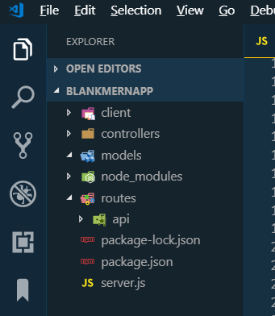

6.	Build the code for the server (srver.js). The code below is an idea that can by copied and paste, and modified for teh individual needs. This offers consiserations for the server once is executed in production and Mongo DB connection string. Replace _'mydatbase'_ with the proper database name.

```js
// server.js : Production Server code
const express = require('express')
const bodyParser = require('body-parser')
const mongoose = require("mongoose")
const routes = require("./routes");

// Start listening - use 3000 if available or next available port
const PORT = process.env.PORT || 3001;

//server variable
const app = express()

// express middleware: capable to handle complex json
app.use(bodyParser.urlencoded({extended: true }))
// express middleware: capable to handle simple json
app.use(bodyParser.json())

// Serve up static assets (usually on heroku)
if (process.env.NODE_ENV === "production") {
  app.use(express.static("client/build"));
}

// Routes
app.use(routes);

// Connect to the Mongo DB 
// IMPORTANT: Change 'mydatabase' to reflect you needs
var MONGODB_URI = process.env.MONGODB_URI || "mongodb://localhost/mydatbase";
mongoose.connect(MONGODB_URI, { useNewUrlParser: true });

// Start listening 
app.listen(PORT, function () {
console.log(`Listening at http://localhost:${PORT}`)
})
```

7. Create the React component by executing the command bellow, and wait for the _“Happy hacking!”_ message. The command can take a moment to complete, but the _'client'_ folder will have all the React initial pieces.
```js
npx create-react-app client
```

8.	In case a folder _‘.git.’_ was created inside the _client’_ folder, **remove it**, otherwise GitHub will refuse to accept the project. Also, remove the _'.gitignore'_ generated under the _client’_ folder. We will add a  _'.gitignore'_ at teh root level.

9.	Add a _‘.gitignore’_ file at the root level that includes the elements bellow. As an example, review at the one included for this project.

```js
  # Dependency directories
  node_modules/
  jspm_packages/
  package-lock.json
  client/node_modules/
  client/package-lock.json
```

10. There will be two _'package.json'_ files. One at the root level, and a second inside the _client’_ folder. Both need to be modified to interconnect them.

* Root _'package.json'_ needs to include two sections, one for the scripts and the other for _‘devDependencies’_. These are as listed below. Again, look at the files included in this exercise to see the full contents.

```js
  // Add/replace scripts below the 'main' section, and replace if exist
  "scripts": {
    "start": "if-env NODE_ENV=production && npm run start:prod || npm run start:dev",
    "start:prod": "node server.js",
    "start:dev": "concurrently \"nodemon --ignore 'client/*'\" \"npm run client\"",
    "client": "cd client && npm run start",
    "install": "cd client && npm install",
    "build": "cd client && npm run build"
  },

  // add bellow the 'license' section the followin element
  "devDependencies": {
    "concurrently": "^4.1.0",
    "nodemon": "^1.18.7"
   },
```

* For the _client/package.json_, insert a _'proxy' element with address to for the local server. 
```js
  // add under 'private' section
  "proxy": "http://localhost:3001/",
```
11. From the root _'package.json'_ move the _'react-router-dom'_ dependency into the _'client/package.json'_, and copy the _'axios'_ dependency also.

FROM: 
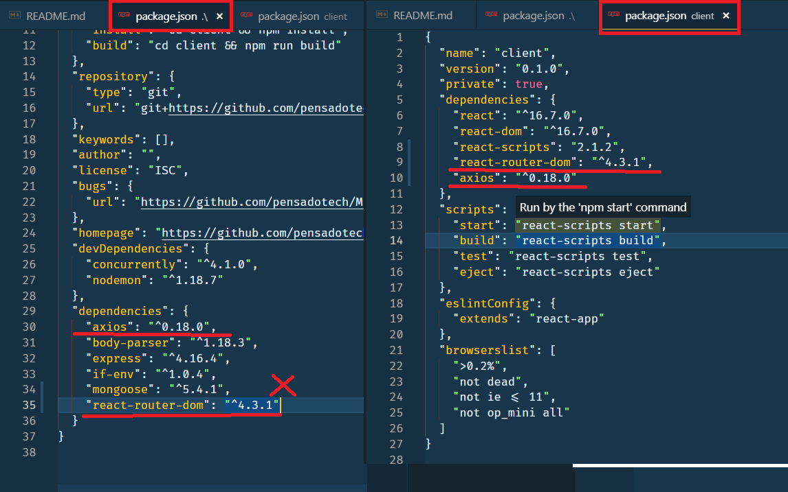

FINAL VERSION:
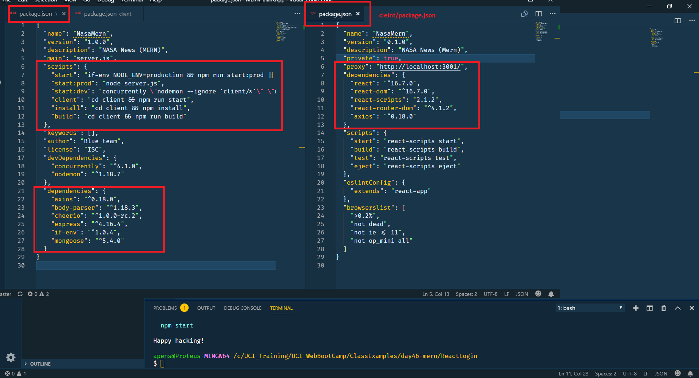

12. Re-run npm dependecies installation with the latest changes in the _'package.json'_ files.

```js
npm i
```

13. Launch the application to test that can run now. Use the following command.

```js
npm start
```
At this point the application will start with teh familar React basic page. 

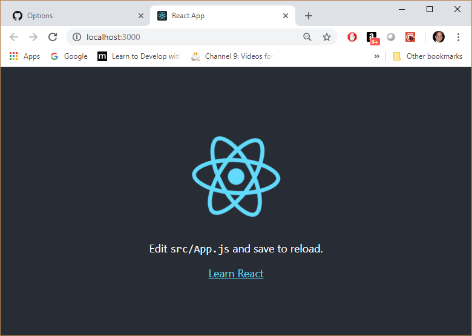

To this point there is a basic MERN infraestructure in place. The next step is to think about the **MVC** patern that includes models, routes/controllers, and viewer (implemented with React).

## Constructing the application

With the basic application running, the next steps is creating all necessary parts for an **MVC** patern: _models, routes/controllers, and viewer_. 

The models will be the Objet Document Mappings (ODM) for the MongoDB, throught the use of _'mongoose'_.

The express routes will be devoted to handle database operations,or operations to retrieve data from outside. They will not be used for traditional HTML pages as MERN is a single page application. React will help defining the view, using components to render the application frontend.

It is importnat to remember that the React components (client/src folders)  is a tool to program the frontend, and all the peices used will eventually be compiled and translated into a single page inside the _‘client/build’_ folder. React just provide the tools to facilitate the work for the developers, but is not what will be deployed.

To ilustrate the next steps to build a **MERN** application, a specific example will be used. The exercise is to retreive NASA latest news and present them to the user, with the option to save the reference to the articles that are interesting, for leater read.

### Models (**M**VC)

The model will represent the collection that will be contained in the database. In this case will be an _Article_ collection.

Any model is created under the _'models'_ folder. Each model filename and object must start with an uppercase letter. That is the recomended convention.

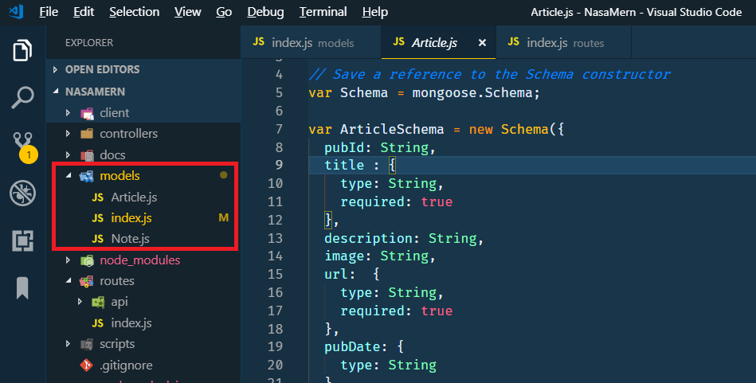


### Express Routes (MV**C**)

The express routes play an important role in a **MERN** application as these will be the way the frontend (React) will communicate with the database or external resources. In this sample application it will be the external communication with the NASA news feed.

The routes are reference in the _’server.js’_ and will read the _’routes/index.js’_ file first, and this need to have also considerations for the distinction between development and production execution. The following example includes this basic ideas.

```js
// Routes Index
const path = require("path");
const router = require("express").Router();
const apiRoutes = require("./api");

// API Routes
router.use("/api", apiRoutes);

// If no API routes are hit, send the React app
router.use(function(req, res) {
  console.log("../client/build/index.html")
  res.sendFile(path.join(__dirname, "../client/build/index.html"));
});

module.exports = router;
```

Inside the _’routes’_ folder, it is recommended to concentrate the all routes into an _’api’_ folder to imply that are only for API operations (not HTML). The _’api’_ folder will have its own _’index.js’_ that will define all routes.  

There will be one file for each specialized API operation. For example, accessing the Articles in the database, or the search for news outside the application. However, each route will use a particular controller to get the action done.

It is inside the controllers that the specialization is concentrated, for example, creating a new article in the database, or accessing the NASA news feed.

The _‘articleRoutes,js’_ will reference the _'articleContoller.js’_  to use the functions to get to the database using the defined models. The following listings presents the idea in general.

Artilce Route:
```js
const router = require("express").Router();
const articlesController = require("../../controllers/articlesController");

// Matches with "/api/articles"
router.route("/")
  .get(articlesController.findAll)
  .post(articlesController.createUpdate)

// Matches with "/api/articles/:id"
router.route("/:id")
  .get(articlesController.findById)
  .put(articlesController.update)
  .delete(articlesController.remove)

module.exports = router
```

Artilce controller:
```js
// Require all models
var db = require("../models");

// Defining methods for the artciles
module.exports = {
  findAll: function(req,res) {
    db.Article.find({})
      .then(dbModel => res.json(dbModel))
      .catch(err => res.status(422).json(err))
  },
  findWhere: function(req, res) {
    db.Article
      .find(req.query)
      .then(dbModel => res.json(dbModel))
      .catch(err => res.status(422).json(err));
  }, 

   //... more code goes here
   // review code for full listing

 } 
```

For this application there are two controles, one for accessing the article collection in the database, and a second to access NASA news feed.

However, there are three routes, a standard articles route, a special article route, and a NASA news feed route. he standard and specialized article routes uses the same controller.

The following image depicts the organization structure for routes and controllers.

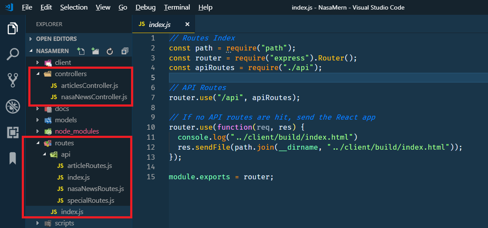


The URL needed for hitting a particular API route is built by several peices, starting from the _'routes/index.js'_, continues with _’routes/api/index.js’_, and ends with the specialized route. For example accessing the articles, the URL is as follows:

```js
   'routes/index.js'             provides =>  '/api'
   'routes/api/index.js'         provides =>  '/articles'
   'routes/api/articleRoutes.js' provides =>  '/' or '/:id'
   
   // The sum of the parst provides the following URL
   '/api/articles/'
   '/api/articles/:id'
```

### React components (M**V**C)

The last part is the implementation of the view using React.  For this section is expected that the reader is familiar with React to avoid going into too much details. Nevertheless, few critical ideas will be explained.  

#### Organizing the public folder

The _’client/public’_ folder holds the _’index.html’_ file, the only HTML page the application will have. This page can be modified to add few special characteristics for the application. However, for the most part it will remain as provided, because React will used it for the final production version after compiling the code. 

If the application needs images, the developer can add a _’images’_ folder as it would with regular web applications. These images can be refrenced in diffrent parts of the applcation. For example, this sample application will refrence the image to use in teh browser tab.

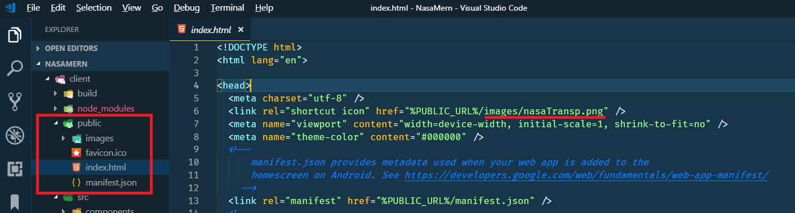

Another aspect of the application will need styling. For react there are many options specific for React (e.g. Boostrap for react https://reactstrap.github.io/). However, for this example, it was decided to keep things simple and to show that regular references to Bootstrap CDN can be used inside the _’index.html’_ file, both CSS and JQuery.

Bootstrap CDN
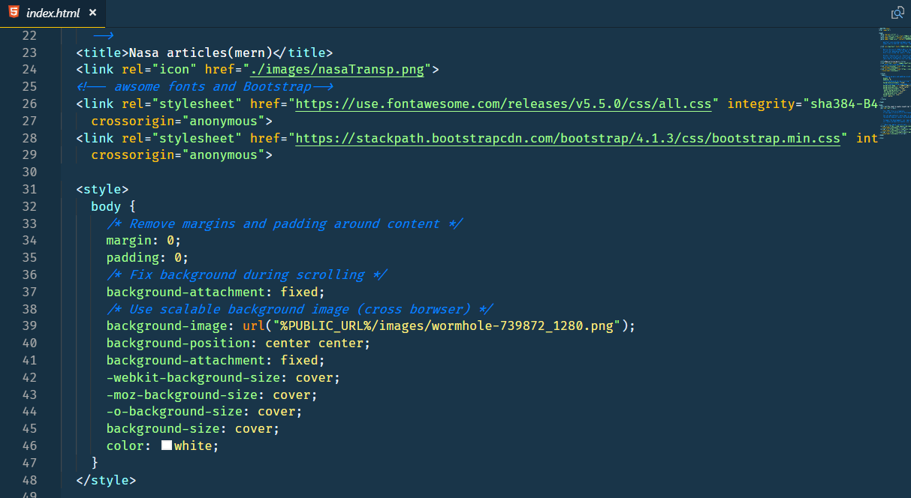

Bootstrap Jquery CDN
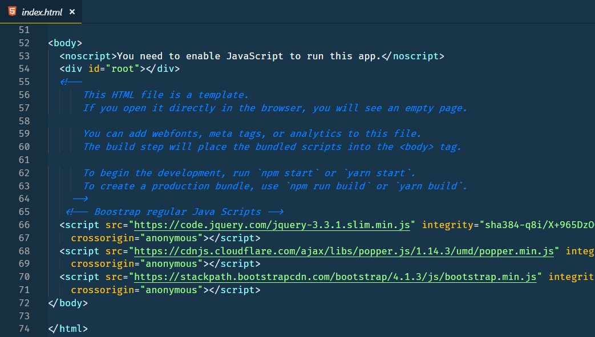

#### Connecting the frontend with the express routes

After setting the _’public/index.html’_ the focus is now inside the _’src’_ folder. In here it is recommended to break he application into folder for _’components’_ and _’pages’_, and work directly into the _’App.js’_ file.  Again, it is expected that the reader is familiar with these concepts.

The one thing is important to mention is how React will connect with the express routes. The frontend user interaction needs to be able to signal actions to retrieve data or reach out NASA news feed and present the data in the screen.

In this example _’axios’_ will be used as a way to do AJAX calls. The AJAX calls will be concentrated inside a _’src/utils’_ folder.

Utility folder for AJAX calls
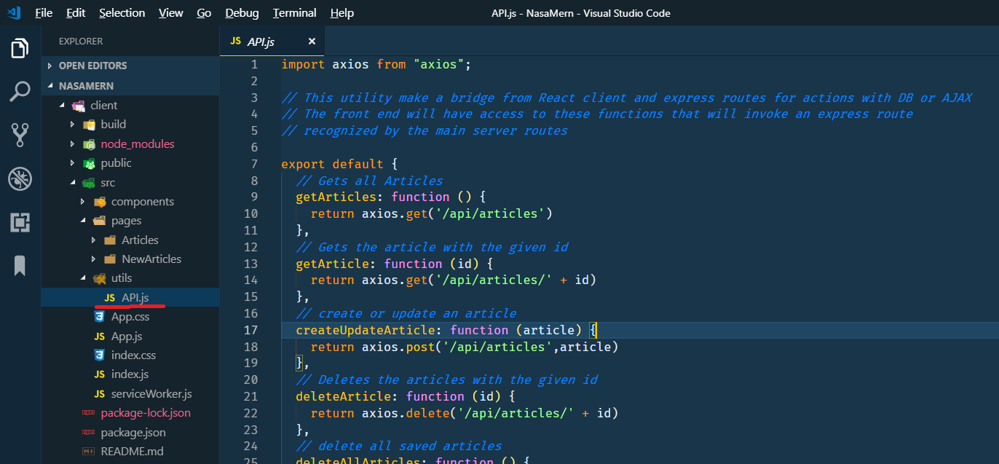
 
It is inside the utility folder that an _’API.js’_ file is created, that will contain all possible AJAX calls to the express routes. In other words, AJAX calls to itself. The file will contain and object with functions. Below is the example contained in the application.

```js
import axios from "axios";

// This utility make a bridge from React client and express routes for actions with DB or AJAX
// The front end will have access to these functions that will invoke an express route
// recognized by the main server routes

export default {
  // Gets all Articles
  getArticles: function () {
    return axios.get('/api/articles')
  },
  // Gets the article with the given id
  getArticle: function (id) {
    return axios.get('/api/articles/' + id)
  },
  // create or update an article
  createUpdateArticle: function (article) {
    return axios.post('/api/articles',article)
  },
  // Deletes the articles with the given id
  deleteArticle: function (id) {
    return axios.delete('/api/articles/' + id)
  },
  // delete all saved articles
  deleteAllArticles: function () {
    console.log('deleteAllArticles')
    return axios.delete('/api/deleteallarticles')
  },
  // get articles from NASA website
  scrapArtilces: function () {
    return axios.get('/api/scrapArtilces')
  }
}
```

From the _’App.js’_ the developer can reference the functions by importing the utilities, and teh functions executed based on the user interaction.

Referencing the API library

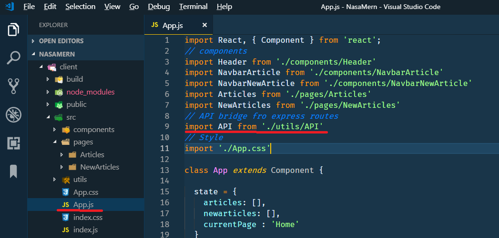

Examples using the API functions are as follows.

```js
  loadArticles = () => {
      API.getArticles()
      .then(res => {
        // store artciles from DB in Array
        this.setState({ articles: res.data })
      })
      .catch(err => console.log(err))
  }
```

Looking for NASA artciles.

```js
  handleSearchNewArticles = event => {  
    API.scrapArtilces()
      .then(res => {
        // Store new articles from ibternet in array
        let tgtarticles = res.data
        this.setState({ newarticles: tgtarticles })
      })
      .catch(err => console.log(err))
  }
```
At this point, the rest of the work for the developer is to build the components that are needed to interact with the user, handling _’state’_ and _’props’_.

## Deploying the applcation to Heroku

To deploy the application to HEROKU, few things are needed:

1. GitHub repository
2. A HEROKU account.

also, several steps are required before pushing teh code to HEROKU:

* Always build the code.
* Check-in and push the code to GitHub.
* Deploy the code to HEROKU.

With these key ideas, opne the VC Code terminal and follow these steps (in genral):

1. Make sure the code is build by using the command:
```js
 npm run build
```
2. Check-in all code and push into GitHub

3. Check for Heroku updates
```js
  heroku update
```
4. Login to heroku using cmd (leave open). Here is teh command.
```js
  heroku login
```
5. Check if heroku is listed as a remote repository
```js
  git remote -v n
```
6. Create an app on Heroku
```js
  heroku create
```
7. set nodejs as build package
```js
  heroku buildpacks:set heroku/nodejs
```
8. Adding Mongo database connection with Mongoose.
```js
  heroku addons:create mongolab
```
9. Push code to Heroku. The command will depend on what brnach the developer is working. Teh following examples is when working from on of teh two: the _master_ or the _dev_ brnaches.
```js
  //Deploy from master to Heroku
  git push heroku master   

  // Deploy from devto Heroku
  git push heroku dev:master
```
**Note**: The Heroku deployment will provide an URL where the applicaiton was created. This can also be find in the Heroku website under settings.

10. For any subsequent code changes and need to re-deploy, the stesp to repeat are 

* Always build the code.
```js
 npm run build
```
* Check-in and push the code to GitHub.

* Deploy the code to HEROKU.
```js
  //Deploy from master to Heroku
  git push heroku master   

  // Deploy from devto Heroku
  git push heroku dev:master
```