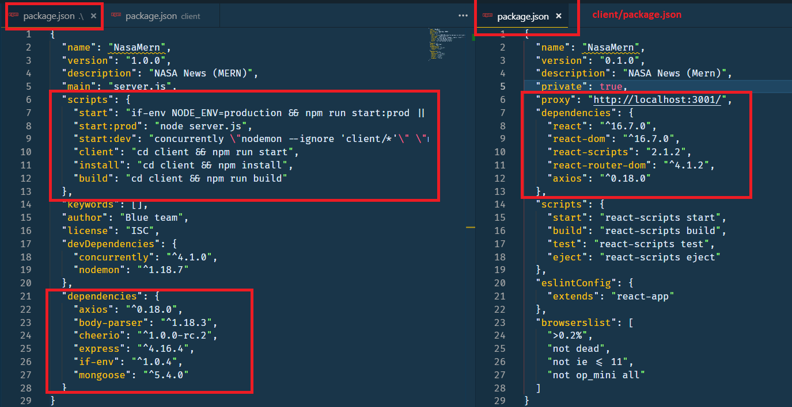

# MERN_BlankApp

Initiali Steps to create a MERN application

_by Armando Pensado_ 

## Description

Putting together a MERN application is complicated and it requires many manual steps and considerations. This article provides the initial steps required and some tips that I hope MERN developer will find beneficial.

* ref: https://www.mongodb.com/blog/post/the-modern-application-stack-part-1-introducing-the-mean-stack

## Things to keep in mind about MERN

* MERN is a Single-page applications.

* The application has a single HTML page (index.html).

* The content in the page is dynamically generated based on the routes.

* Interaction is based on AJAX calls.

* For the most part JavaScript is used to generate the page contents.

* MERN Uses React, NodeJS, npm on top of conventional languages.

* MERN is a solution that in its hart contains react, but it is wrapped by NodeJS and Express. 

* The folder structure will contain at the root a _'server.js'_ and a _'client_' folder. React will be inside the _'client_' folder.

* Under development (laptop), the solution will execute essentially  the react portion inside the _'client/src'_ folder using **"webpack dev server"**. However, when in production, the _'server.js'_ will be executed.

* There are two interconnected package.json. One at the root level, and one inside the "client" folder for the REACT portion. The package.json defined as "scripts" section. This needs to have the proper elements to invoke scripts inside the client/pakage.json.

* The development execution and the server execution will use different ports. As an example REACT will use port **3000**, and the server will be set to **3001**. If needed, these elements are configurable.

* Before deploying to production the project must be build.  The build command will create a _"client/build"_ folder that will hold the production-version of the solution. This will be used by the _"server.js"_ once is sitting in production. 

## Pre-Requisites for a MENR application

* Node JS and Mongo DB must be installed.
* If the application needs to be stored in GitHub, create a repo and clone into the computer local drive.

## Initial steps to create a MERN skeleton application

1.	Create a project folder and in the folder create a file “server.js”.
2.	Open the VSCode terminal.

3.	Initialize as ‘npm’ project :  
```js
npm init -y
```
4.	Add Express and  other critical ‘npm’ packages, here is a commna basic list
```js
npm i express mongoose body-parser
npm i if-env
npm i axios
npm i react-router-dom
```
5.	Create the initial folder structure, that includes the following folders: 
```js
   client, 
   controllers,
   models, 
   routes, and 
   routes/api.  
```
* It should resemble something as follows:


6.	Build the code for the server (srver.js). The code below is an idea that can by copied and paste.
```js
// server.js : Production Server code
const express = require('express')
const bodyParser = require('body-parser')
const mongoose = require("mongoose")
const routes = require("./routes");

// Start listening - use 3000 if available or next available port
const PORT = process.env.PORT || 3001;

//server variable
const app = express()

// express middleware: capable to handle complex json
app.use(bodyParser.urlencoded({extended: true }))
// express middleware: capable to handle simple json
app.use(bodyParser.json())

// Serve up static assets (usually on heroku)
if (process.env.NODE_ENV === "production") {
  app.use(express.static("client/build"));
}

// Routes
app.use(routes);

// Connect to the Mongo DB 
// IMPORTANT: Chnage 'mydatabase' to reflect you needs
var MONGODB_URI = process.env.MONGODB_URI || "mongodb://localhost/mydatbase";
mongoose.connect(MONGODB_URI, { useNewUrlParser: true });

// Start listening 
app.listen(PORT, function () {
console.log(`Listening at http://localhost:${PORT}`)
})
```

7. Create the React component by executing the following command and Wait for the _“Happy hacking!”_ message. The command can take a moment to complete, but the _'client'_ folder will have all the React initial pieces.
```js
npx create-react-app client
```
8.	In case a folder _‘.git.’_ folder was created inside the _client’_ folder, **remove it**, otherwise GitHub will refuse to accept the project. Also, remove the _'.gitignore'_ generated under the _client’_ folder.

9.	Add a _‘.gitignore’_ file at the root level that includes the elements bellow. Look at the one included for this project

```js
  # Dependency directories
  node_modules/
  jspm_packages/
  package-lock.json
  client/node_modules/
  client/package-lock.json
```

10. There will be two _'package.json'_ files. One at the root level, and a second inside the _client’_ folder. Both need to be modified to interconnect them.

* Root _'package.json'_:  need to include two sections, one for the scripts and the other for _‘devDependencies’_. 

```js
  // Add/replace scripts below the 'main' section, and replace if exist
  "scripts": {
    "start": "if-env NODE_ENV=production && npm run start:prod || npm run start:dev",
    "start:prod": "node server.js",
    "start:dev": "concurrently \"nodemon --ignore 'client/*'\" \"npm run client\"",
    "client": "cd client && npm run start",
    "install": "cd client && npm install",
    "build": "cd client && npm run build"
  },

  // add bellow the 'license' section the followin element
  "devDependencies": {
    "concurrently": "^4.1.0",
    "nodemon": "^1.18.7"
   },
```

* _client/package.json_ : insert a _'proxy' element with address to foloca server. 
```js
  // add under 'private' section
  "proxy": "http://localhost:3001/",
```
11. From the root _'package.json'_ move the _'react-router-dom'_ dependency into the _'client/package.json'_, and copy the _'axios'_ depenndecy also.

FROM: 


TO:


12. Re-run npm dependecies with teh latest changes in teh _'package.json'_ files
```js
npm i
```

13. Launch teh application to test that can run now.

```js
npm start
```


## Constructing the applicaitons

With the basic application running, the following steps is creating necessary routes and add elements to the React components. 

The express routes will be devoted to handle database operations,or operations to retrieve data from outside. They will not be used for traditional HTML pages as a MERN is a single page application. The screen manipulation will render information on the screen by using ‘components'.

The React components (client/src folders) is a tool to program the frontend, and all the peices used will eventually be compiled and translated into a single page inside the ‘client/build’ folder. React just provide the tools to facilitate the work for the developers, but is not what will be deployed.

### Express Routes


### React components


## Deploying the applciation to Heroku


## MERN Tiricks and ideas


* Create API routes at '/routes', using express router. Thies need to be connected with the 'controller' libraries, which holds all libaries to access teh database or any externla AJAX calls.

* Inside teh clinet/src, ceate a "utils" folder, and inside create an API library ("API.js") that will be used for the react code to invoke the express routes. This is the bridge between the react geenrated front end and the server functionality to manipulate data.